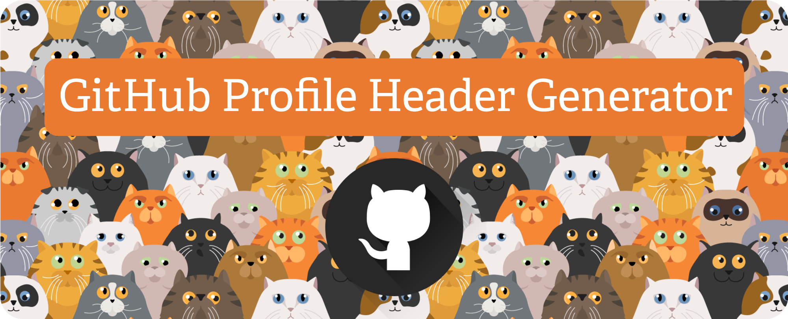

# Auto Generated README File 

## Description
I learned to work smarter, not harder and am happy to never have to write anothe README file from s scratch again .    
## Table of Contents
* [Features](#features)
* [Languages](#languages)
* [Installation](#installation)
* [Usage](#usage)
* [License](#license)
* [Contributors](#contributors)
* [Testing](#testing)
* [Questions](#questions)
## Features
I hope you like my banner! :)
## Languages
node.js
## Installation
No
## Usage  
Auto generated README files
## License

This project is licensed under the [MIT](https://opensource.org/licenses/MIT) license.  

https://opensource.org/licenses/MIT
## Contributors
Me and ChatGPT
## Testing
Yes, many times before this video was recorded.
## Questions
Please send your questions [here](mailto:sarah.higley19@gmail.com?subject=[GitHub]%20Dev%20Connect) or visit [github/sarahigley19](https://github.com/sarahigley19).

## Watch the Video Walkthrough
https://www.youtube.com/watch?v=eaNAm16ug-k
